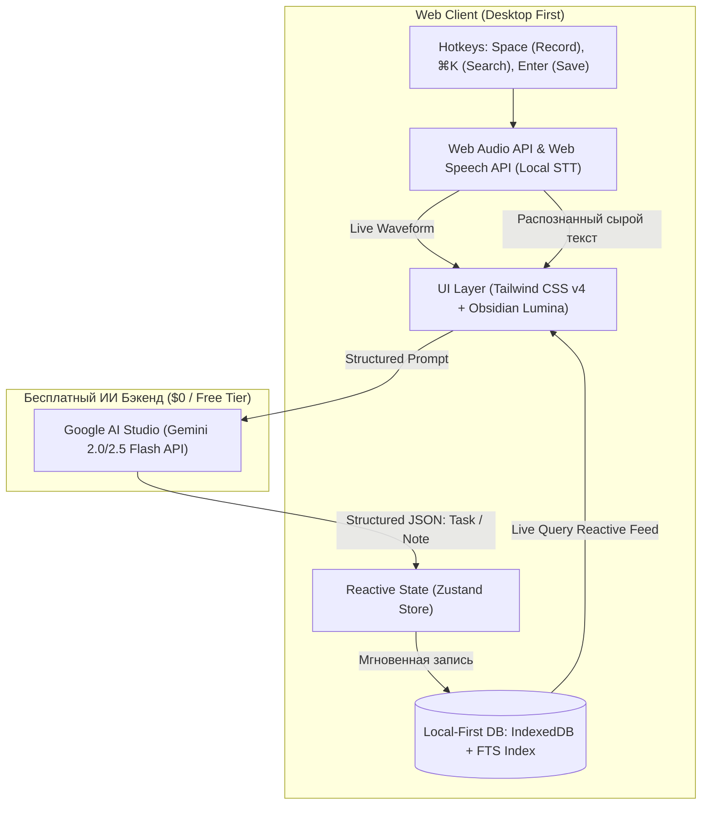

# Product Requirements Document (PRD)
# VoiceNotes AI — Intelligent Voice & Task Workspace (Desktop Web)

**Версия:** 2.4.0  
**Дата ревизии:** Октябрь 2026  
**Статус:** Утверждено к разработке  
**Приоритет платформы:** Web Desktop (Phase 1) → Mobile Cross-Platform (Phase 2)  
**Репозиторий:** `d:\relax\projects\voicenotes`  

---

## 1. Введение и Видение Продукта

### 1.1. Назначение системы
**VoiceNotes AI** — это легковесное, реактивное веб-приложение для мгновенного захвата, структурирования и ведения заметок и задач. Система позволяет пользователю надиктовывать идеи голосом или вводить их текстом, а встроенный искусственный интеллект на базе **Google AI Studio (Gemini 2.0/2.5 Flash)** очищает поток мыслей от мусора и оговорок, классифицирует сущность (задача vs заметка), извлекает дедлайны, приоритеты, теги и генерирует структурированные чек-листы.

### 1.2. Проблема, которую решает продукт
- **Трение при записи мыслей:** Классические заметочники требуют долгой ручной сортировки, расстановки папок и дат.
- **Потеря контекста голосовых записей:** Стандартные диктофоны сохраняют «слепые» аудиофайлы, в которых невозможно быстро найти нужную мысль.
- **Высокая стоимость AI-сервисов:** Большинство решений требуют дорогой платной подписки ($10–20/мес). VoiceNotes AI спроектирован под **$0/месяц затрат** благодаря бесплатному уровню Gemini Flash и архитектуре Local-First.

### 1.3. Ключевые метрики успеха (KPIs)
- **Time to First Thought:** Время от открытия вкладки браузера до начала записи голоса < 1.0 секунды (горячая клавиша `Space`).
- **Zero API Cost for Core App:** Эксплуатация пет-проекта в пределах бесплатного лимита Google AI Studio (15 RPM / 1500 RPD).
- **Zero Latency Search:** Поиск по всей базе заметок < 3 мс благодаря локальному поисковому индексу.
- **100% Offline Read/Write:** Создание и чтение заметок без подключения к интернету.

---

## 2. Архитектура и Технологический Стек

### 2.1. Стек технологий (Октябрь 2026)
- **Фреймворк:** **React 19 + TypeScript + Vite** (сверхбыстрый HMR, легковесность, мгновенная сборка).
- **Стилизация:** **Tailwind CSS v4** с внедрением дизайн-системы **Obsidian Lumina**.
- **Типографика и Иконки:** Шрифты Google Fonts (`Plus Jakarta Sans`, `Inter`, `JetBrains Mono`), иконки `Material Symbols Outlined`.
- **Локальная база данных:** **IndexedDB** (через Dexie.js) с поддержкой реактивных запросов (Live Queries).
- **Полнотекстовый поиск (FTS):** **MiniSearch** / **IndexedDB FTS** на стороне клиента (стемминг для русского и английского языков).
- **Стейт-менеджмент:** **Zustand** с персистентностью.
- **Аудио-движок:** 
  - Захват звука: **MediaRecorder API** (формат `audio/webm;codecs=opus`).
  - Визуализация волны: **Web Audio API** (`AudioContext`, `AnalyserNode`) с отрисовкой на HTML5 Canvas.
  - Потоковое распознавание: **Web Speech API** (`webkitSpeechRecognition`).
- **ИИ-ядро:** **Google AI Studio API** (модели `gemini-2.0-flash` / `gemini-2.5-flash`) с поддержкой **Structured Outputs (JSON Schema)**.

### 2.2. Архитектурная диаграмма



---

## 3. Дизайн-система «Obsidian Lumina»

*Разработана на основе макета Stitch: проект `8693731237068102169`, экран `76c480feb2144c30acf6e3c6dfee2bde`.*

### 3.1. Цветовая палитра
```css
:root {
  /* Базовые поверхности */
  --bg-surface: #121317;
  --bg-surface-container-low: #1a1b20;
  --bg-surface-container: #1f1f24;
  --bg-surface-container-high: #292a2e;
  --bg-surface-container-highest: #343439;
  --bg-surface-container-lowest: #0d0e12;

  /* Акценты */
  --color-primary: #a078ff;          /* Electric Violet */
  --color-primary-container: #340080;
  --color-secondary: #4edea3;        /* Cyber Emerald */
  --color-secondary-container: #00a572;
  --color-tertiary: #cebdff;
  --color-error: #ffb4ab;

  /* Текст и контуры */
  --text-on-surface: #e3e2e8;
  --text-on-surface-variant: #cbc3d7;
  --text-outline: #958ea0;
  --text-outline-variant: #494454;
}
```

### 3.2. Типографика
- **Display & Заголовки:** `Plus Jakarta Sans` (font-weight: 600, 700).
- **Основной текст и списки:** `Inter` (font-weight: 400, 500).
- **Код, таймкоды, технические метки:** `JetBrains Mono` / `Plus Jakarta Sans` (font-weight: 600, tracking: wide).

---

## 4. Спецификация пользовательского интерфейса (3-колоночный дашборд)

Интерфейс разделен на три анатомические области:

### 4.1. Левый сайдбар (Left Sidebar, фиксированная ширина `w-72` / 288px)
- **Логотип:** `VoiceNotes AI` с бейджем версии `v2.4`.
- **Селектор рабочего пространства:** Дропдаун «Личное пространство» со статусом «Синхронизировано».
- **Навигация:**
  1. `Главная / Обзор` (иконка `space_dashboard`, активное состояние `bg-primary-container text-on-primary-container`).
  2. `Заметки и аудио` (иконка `mic`, бейдж количества `42`).
  3. `Задачи` (иконка `check_circle`, мятный бейдж `12`).
  4. `Календарь` (иконка `calendar_today`).
  5. `AI Сводки` (иконка `auto_awesome`, пульсирующая зеленая точка).
  6. `Настройки` (иконка `settings`).
- **Индикатор ресурсов:** Прогресс-бар «Облако активно: 82%», «Хранилище аудио: 16.4 / 20 ГБ».
- **Профиль пользователя:** Аватар, «Алексей Орлов», бейдж «Pro Лицензия», контекстное меню `...`.

### 4.2. Верхняя панель (Header, `h-16` / 64px)
- **Глобальный поиск:** Поле «Поиск заметок, аудио, сводок...» с бейджем горячей клавиши `⌘K`.
- **Текущая дата:** Индикатор «Сегодня, 24 Окт».
- **Кнопка быстрой записи:** Кнопка `+ Запись` с неоновым фиолетовым свечением.
- **Уведомления:** Иконка колокольчика с индикатором новых событий.
- **Мини-аватар профиля**.

### 4.3. Центральная рабочая область (Main Content Area, col-span-7)
- **Статусная плашка:** Зеленая точка, текст `• ГОТОВО К СИНХРОНИЗАЦИИ • Облако активно`.
- **Приветственный блок:** «Добрый вечер, Александр», текущая дата («Пятница, 4 октября»), статус «3 сессии обработаны AI».
- **Панель быстрых действий:**
  - Переключатель вида: **Список** (активен) / **Доска**.
  - Кнопка `+ Новая заметка`.
  - Главная кнопка `Начать запись [Space]` с пульсирующей иконкой микрофона.
- **Hero-карточка («В фокусе»):**
  - Мета-бейджи: пульсирующий мятный `В фокусе`, тег `#Работа`, `! Высокий приоритет`, дедлайн `21:00`.
  - Заголовок: *«Добавить новую фичу в VoiceNotes»*.
  - Описание: *«Контекстное связывание голосовых заметок с календарем и автогенерация задач»*.
  - **Встроенный аудиоплеер:** визуализатор звуковой волны, таймкод `0:18 / 01:42`, бейдж `Whisper AI Транскрипция`, цитата транскрипта.
  - Кнопки: `✓ Завершить`, `AI Сводка`, микрофон, меню действий.
- **Фильтры задач:** Вкладки `Все 4`, `Срочные 1`, `Голосовые 3`, `Сводки 1`, сортировка «По приоритету».
- **Список задач дня:** Чекбоксы с тактильной анимацией, теги (`#Аналитика`, `#Разработка`, `#Дизайн`, `#Финансы`), дедлайны, зачеркивание завершенных (`Выполнено в 14:15`).
- **Строка быстрого ввода:** Поле *«Быстрая мысль или задача... | Enter — сохранить»*, кнопка микрофона, кнопка ИИ-обработки.

### 4.4. Правая колонка контекста и метрик (Right Sidebar, col-span-5)
- **Bento-метрики продуктивности:**
  - Карточка «ВЫПОЛНЕНО: 3 из 7 задач» (+34% к среде).
  - Карточка «В ПЛАНЕ: 4 задачи» (оценка времени ~2.8 ч).
- **Виджет «Недавние аудиозаписи»:** Список последних голосовых сессий с кнопкой play прямо в строке.
- **Виджет «AI Сводка дня»:** Аналитические теги (`#Микросервисы`, `#Q3 Метрики`, `#Дизайн-система`), выжимка дня и кнопка «Сгенерировать полный отчет за день».
- **Индикатор синхронизации девайсов:** Карточка «MacBook Pro + iPhone 16 Pro Connected».

---

## 5. Модель Данных (Схема БД)

### 5.1. Сущность `Item` (Заметки и Задачи)
```typescript
export interface Item {
  id: string; // UUID v4
  type: 'task' | 'note';
  title: string;
  description?: string;
  transcriptText?: string;
  audioDuration?: number; // В секундах
  audioUrl?: string; // Локальный blob или mock
  status: 'todo' | 'in_progress' | 'completed' | 'archived';
  priority: 'low' | 'medium' | 'high';
  dueDate?: string; // ISO-8601 строка
  completedAt?: string; // ISO-8601 строка
  categoryTag: string; // Например: 'Работа', 'Аналитика', 'Дизайн'
  isFocus: boolean; // Отображается ли в верхнем Hero-виджете
  checklist?: ChecklistItem[];
  createdAt: string;
  updatedAt: string;
}

export interface ChecklistItem {
  id: string;
  text: string;
  isCompleted: boolean;
  sortOrder: number;
}
```

### 5.2. Сущность `AudioSession`
```typescript
export interface AudioSession {
  id: string;
  title: string;
  duration: number; // В секундах
  recordedAt: string;
  transcriptSnippet: string;
  tags: string[];
}
```

---

## 6. ИИ-Интеграция: Контракт со Structured Outputs

### 6.1. JSON Schema для Google AI Studio
```json
{
  "type": "object",
  "properties": {
    "entity_type": { "type": "string", "enum": ["task", "note"] },
    "title": { "type": "string" },
    "description": { "type": "string" },
    "due_date": { "type": "string", "nullable": true },
    "priority": { "type": "string", "enum": ["low", "medium", "high"] },
    "category_tag": { "type": "string" },
    "transcript_summary": { "type": "string" },
    "checklist": {
      "type": "array",
      "items": { "type": "string" }
    }
  },
  "required": ["entity_type", "title", "priority", "category_tag"]
}
```

### 6.2. Системный промпт
```text
Ты — персональный ассистент приложения VoiceNotes AI.
Пользователь надиктовывает или вводит текст. Твоя задача — вернуть строгий JSON по схеме.
Правила:
1. "task" — если есть действие, поручение, дедлайн. "note" — если это мысль или идея.
2. Очищай текст от слов-паразитов ("эээ", "ну", "типа", "короче").
3. Относительные даты ("сегодня к 9 вечера", "завтра в 16:30") преобразуй в точный ISO-8601 штамп.
4. Присваивай категорию: "Работа", "Аналитика", "Разработка", "Дизайн", "Финансы", "Личное".
```

---

## 7. Реестр Задач Проекта (Task Registry)

Каждая задача вынесена в отдельный детальный технический документ в директории `tasks/`:

| ID | Задача | Файл документации |
| :--- | :--- | :--- |
| **TASK-01** | Инициализация проекта, базовая структура и зависимости | [`tasks/TASK-01-project-init.md`](tasks/TASK-01-project-init.md) |
| **TASK-02** | Дизайн-система Obsidian Lumina (Tailwind CSS v4 & Токены) | [`tasks/TASK-02-design-system.md`](tasks/TASK-02-design-system.md) |
| **TASK-03** | 3-колоночный каркас приложения (Sidebar, Header, Main Canvas) | [`tasks/TASK-03-app-layout-shell.md`](tasks/TASK-03-app-layout-shell.md) |
| **TASK-04** | Клиентский роутинг и переключение разделов | [`tasks/TASK-04-client-routing.md`](tasks/TASK-04-client-routing.md) |
| **TASK-05** | Локальное хранилище данных (IndexedDB + Dexie.js) | [`tasks/TASK-05-local-database.md`](tasks/TASK-05-local-database.md) |
| **TASK-06** | Реактивный стейт-менеджмент (Zustand Store) | [`tasks/TASK-06-state-management.md`](tasks/TASK-06-state-management.md) |
| **TASK-07** | Инициализация демо-данными (Seed Data из макета) | [`tasks/TASK-07-seed-data.md`](tasks/TASK-07-seed-data.md) |
| **TASK-08** | Локальный полнотекстовый поиск (MiniSearch FTS) | [`tasks/TASK-08-full-text-search.md`](tasks/TASK-08-full-text-search.md) |
| **TASK-09** | Захват звука с микрофона (MediaRecorder API) | [`tasks/TASK-09-audio-recording.md`](tasks/TASK-09-audio-recording.md) |
| **TASK-10** | Анимированный визуализатор звуковой волны (Canvas Waveform) | [`tasks/TASK-10-live-waveform.md`](tasks/TASK-10-live-waveform.md) |
| **TASK-11** | Нативное распознавание речи (Web Speech API) | [`tasks/TASK-11-web-speech-stt.md`](tasks/TASK-11-web-speech-stt.md) |
| **TASK-12** | Компонент аудиоплеера с таймкодами и скраббингом | [`tasks/TASK-12-audio-player.md`](tasks/TASK-12-audio-player.md) |
| **TASK-13** | Хоткей быстрой записи пробелом (`Space` shortcut) | [`tasks/TASK-13-space-hotkey.md`](tasks/TASK-13-space-hotkey.md) |
| **TASK-14** | Сервис Google AI Studio (Gemini 2.0/2.5 Flash API Client) | [`tasks/TASK-14-gemini-client.md`](tasks/TASK-14-gemini-client.md) |
| **TASK-15** | ИИ-структурирование заметок (Structured Outputs Parser) | [`tasks/TASK-15-ai-structuring.md`](tasks/TASK-15-ai-structuring.md) |
| **TASK-16** | Цикл итеративной доработки промпта (Refinement Loop) | [`tasks/TASK-16-ai-refinement.md`](tasks/TASK-16-ai-refinement.md) |
| **TASK-17** | Шапка дашборда и динамическое приветствие | [`tasks/TASK-17-dashboard-header.md`](tasks/TASK-17-dashboard-header.md) |
| **TASK-18** | Hero-карточка активной задачи («В фокусе») | [`tasks/TASK-18-focus-hero-card.md`](tasks/TASK-18-focus-hero-card.md) |
| **TASK-19** | Интерактивный список задач дня и фильтрация | [`tasks/TASK-19-task-list-filters.md`](tasks/TASK-19-task-list-filters.md) |
| **TASK-20** | Командная строка быстрого ввода (Quick Input Bar) | [`tasks/TASK-20-quick-input-bar.md`](tasks/TASK-20-quick-input-bar.md) |
| **TASK-21** | Правый Bento-блок продуктивности (Счетчики метрик) | [`tasks/TASK-21-bento-metrics.md`](tasks/TASK-21-bento-metrics.md) |
| **TASK-22** | Виджет «Недавние аудиозаписи» | [`tasks/TASK-22-recent-audio-widget.md`](tasks/TASK-22-recent-audio-widget.md) |
| **TASK-23** | Виджет «AI Сводка дня» и генерация отчета | [`tasks/TASK-23-ai-daily-summary.md`](tasks/TASK-23-ai-daily-summary.md) |
| **TASK-24** | Страница «Заметки и аудио» с карточками и тегами | [`tasks/TASK-24-notes-hub-page.md`](tasks/TASK-24-notes-hub-page.md) |
| **TASK-25** | Страница «Задачи» с Канбан-доской и drag-and-drop | [`tasks/TASK-25-tasks-kanban-page.md`](tasks/TASK-25-tasks-kanban-page.md) |
| **TASK-26** | Страница «Календарь» с временной шкалой | [`tasks/TASK-26-calendar-timeline-page.md`](tasks/TASK-26-calendar-timeline-page.md) |
| **TASK-27** | Страница «AI Сводки» с аналитическими дайджестами | [`tasks/TASK-27-ai-summaries-page.md`](tasks/TASK-27-ai-summaries-page.md) |
| **TASK-28** | Страница «Настройки и Профиль» (BYOK API-ключ) | [`tasks/TASK-28-settings-page.md`](tasks/TASK-28-settings-page.md) |
| **TASK-29** | Глобальная командная палитра поиска (`⌘K` Command Palette) | [`tasks/TASK-29-command-palette-cmdk.md`](tasks/TASK-29-command-palette-cmdk.md) |
| **TASK-30** | Экспорт заметки в Markdown (.md) и горячие клавиши | [`tasks/TASK-30-markdown-export.md`](tasks/TASK-30-markdown-export.md) |
